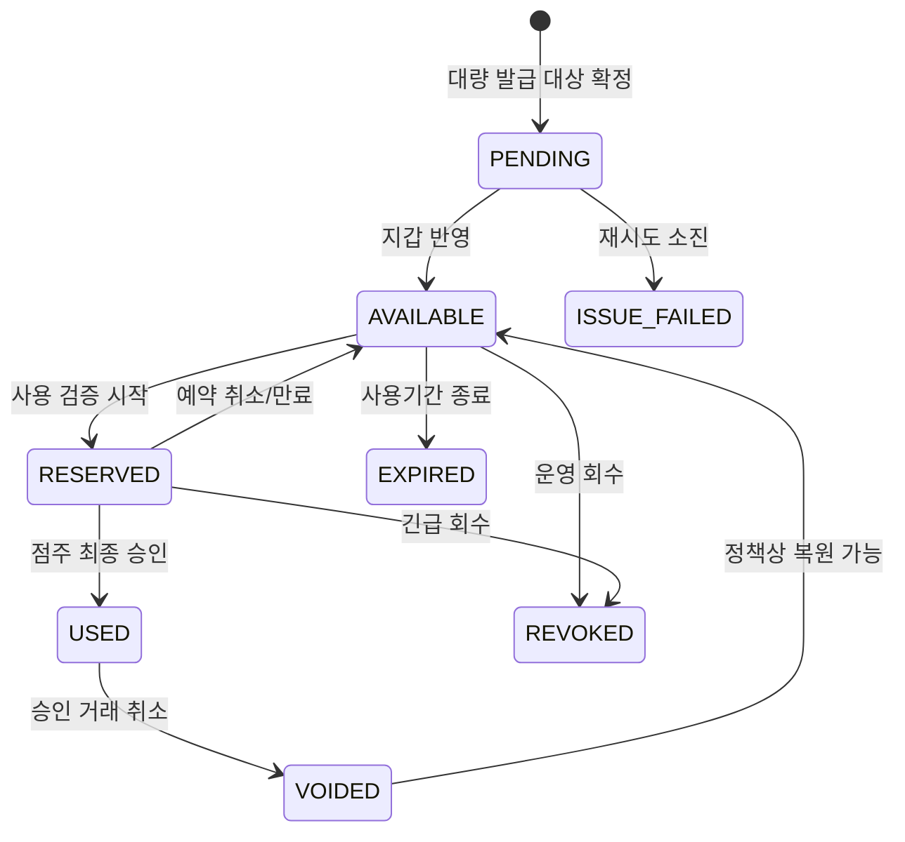

# DDADAN 상점별 쿠폰 시스템 시나리오 명세

> 문서 상태: 구현 기준안  
> 대상 출시: 대한민국 운영 가능 MVP  
> 최종 갱신: 2026-08-10  
> 관련 문서: [상세 제품·기술 기획서](./product-spec.md)

## 1. 문서 목적

이 문서는 소규모 독립 상점이 방문 도장과 할인 쿠폰을 발행하고, 소비자가 여러 상점의 혜택을 한 계정에서 보관·사용하는 과정에서 발생할 수 있는 정상, 대체, 오류, 동시성, 악용, 복구 시나리오를 정의한다.

여기서 "모든 가능한 시나리오"는 임의의 무한한 입력 조합이 아니라 다음 경로를 빠짐없이 다룬다는 뜻이다.

- 정의된 기능의 정상 경로와 사용자가 중간에 이탈하는 경로
- 인증·권한·입력·외부 연동 실패 경로
- 수량, 기간, 상태 변경의 경계값과 동시 요청
- 중복 요청, 재시도, 메시지 중복 전달 같은 분산 시스템 경로
- 계정 탈취, QR 공유, 봇 선점, 권한 상승 등 현실적인 악용 경로
- 운영자 취소, 원장 보정, 장애 복구, 개인정보 처리 경로

## 2. 범위와 기본 전제

### 2.1 MVP 포함

- 이메일/비밀번호 및 카카오 로그인, 회원가입, 계정 연결, 탈퇴
- 한 계정의 소비자·점주 다중 역할
- 계정당 한 개 상점 소유, 점주 1인 운영
- 주문 건당 방문 도장 적립과 목표 달성 리워드
- 정액·정률·무료 품목 할인 쿠폰 캠페인
- 대상자 직접 지급 및 선착순 받기
- 소비자 통합 쿠폰 지갑과 회전형 QR
- 점주 웹앱의 카메라 스캔 또는 코드 입력을 통한 적립·사용 승인
- 앱 내 알림, FCM Web Push, 카카오 알림톡
- 시스템 관리자의 검수·정지·보정·민원·감사 기능
- 비동기 발급, 만료, 알림, 집계 작업

### 2.2 MVP 제외

- POS·키오스크·결제사 자동 연동
- 프랜차이즈, 다지점, 직원 계정과 근무 교대
- 소비자 간 쿠폰 선물·양도·합산
- 오프라인 적립과 오프라인 쿠폰 사용
- 유료 플랜 결제, 정산, 세금계산서
- 네이티브 모바일 앱
- 현금성 포인트, 충전금, 환전

### 2.3 기본 지역 정책

- 언어: 한국어
- 통화: KRW, 모든 금액은 원 단위 정수
- 시간 저장: UTC, 화면 표시와 영업일 계산은 상점의 IANA 타임존 사용
- 초기 상점 타임존: `Asia/Seoul`
- 주 시작일: 월요일
- 기간 표현: 시작 시각 포함, 종료 시각 미포함(`[start_at, end_at)`)

## 3. 액터와 권한

| 액터 | 설명 | 주요 권한 |
|---|---|---|
| 비회원 | 인증하지 않은 방문자 | 서비스 소개, 공개 상점·캠페인 열람, 로그인 시작 |
| 소비자 | 소비자 프로필이 활성화된 회원 | 상점 관심 등록, 쿠폰 받기, 지갑 조회, QR 제시, 알림 설정 |
| 점주 | 상점 소유자 역할을 가진 회원 | 자기 상점·정책·캠페인 관리, 적립/사용 승인, 고객·통계 조회 |
| 시스템 관리자 | 플랫폼 운영 권한을 가진 내부 사용자 | 상점 검수, 회원 제재, 캠페인 중단, 원장 보정, 감사·민원 처리 |
| 인증 제공자 | Firebase Auth, Kakao OIDC | 신원 인증, 토큰 발급·검증, 연결 해제 통지 |
| 메시지 제공자 | FCM, 카카오 알림톡 사업자 | 알림 전달과 결과 콜백 |
| 백그라운드 워커 | Redis 큐 소비자 | 대량 발급, 만료, 알림, 집계, 파기, 복구 |

권한의 기준은 Firebase custom claim이 아니라 PostgreSQL의 활성 역할과 상점 소유 관계다. 토큰의 역할 정보는 화면 최적화에만 사용할 수 있고, 모든 변경 API는 서버가 DB를 다시 확인한다.

## 4. 핵심 용어와 상태

### 4.1 용어

| 용어 | 정의 |
|---|---|
| 회원 | 하나의 내부 `user_id`와 하나 이상의 인증 제공자 연결을 가진 사람 |
| 소비자 키 | 서버 내부에서만 쓰는 변경 불가능한 UUID. QR에 원문으로 노출하지 않음 |
| 상점 고객 | 특정 상점에서 관심 등록, 도장 적립 또는 쿠폰 보유 이력이 있는 소비자 |
| 도장 정책 | 적립 조건, 목표 개수, 도장 만료, 리워드 조건을 묶은 버전형 설정 |
| 도장 원장 | 적립·취소·만료·보정 사건을 삭제하지 않고 기록한 불변 내역 |
| 리워드 | 목표 도장을 채웠을 때 생성되는 쿠폰 인스턴스 |
| 캠페인 | 할인 쿠폰의 내용, 대상, 수량, 발급·사용 기간을 정의한 발행 단위 |
| 쿠폰 인스턴스 | 특정 소비자에게 귀속된 실제 사용권 1개 |
| 사용 예약 | 점주가 사용 조건을 확인하는 동안 쿠폰을 짧게 잠가 이중 사용을 막는 상태 |
| 영업일 | 자정 기준 달력일이 아니라 상점이 설정한 영업일 전환 시각 기준 날짜 |
| 멱등키 | 같은 사용자 행위를 재전송해도 결과가 한 번만 발생하도록 식별하는 키 |

### 4.2 상점 상태

`DRAFT → PENDING_REVIEW → ACTIVE ↔ SUSPENDED → CLOSED`

- `DRAFT`: 점주만 볼 수 있고 적립·발급 불가
- `PENDING_REVIEW`: 시스템 관리자 검수 대기
- `ACTIVE`: 정상 운영
- `SUSPENDED`: 신규 적립·발급·사용 중지, 조회와 민원 처리는 허용
- `CLOSED`: 영구 폐점. 법정 보존 항목 외 개인정보 파기 예약

### 4.3 도장 정책 상태

`DRAFT → SCHEDULED → ACTIVE → PAUSED → ENDED`

- 활성 정책 내용은 직접 덮어쓰지 않는다. 조건 변경은 새 버전을 만들며 기존 도장에는 적립 당시 버전과 만료 규칙을 유지한다.
- 상점에는 동시에 활성인 기본 방문 도장 정책이 최대 1개다.

### 4.4 캠페인 상태

`DRAFT → SCHEDULED → ISSUING → PAUSED → ENDED`

추가 종결 상태는 `CANCELLED`다. 발급된 쿠폰 회수 여부는 취소 작업에서 별도로 선택한다.

### 4.5 쿠폰 인스턴스 상태

`USED`, `EXPIRED`, `REVOKED`는 일반 사용자가 되돌릴 수 없는 종결 상태다. 관리자 보정은 이전 행을 수정하지 않고 새 감사 사건을 추가한다.

## 5. 공통 판정 규칙

### 5.1 요청 우선순위

모든 변경 요청은 다음 순서로 판정한다.

1. 인증 토큰 유효성
2. 계정 활성 상태와 필수 약관 버전
3. 역할 및 대상 리소스 소유권
4. 상점 상태
5. 멱등키 중복 여부
6. 요청 대상의 현재 상태
7. 기간, 수량, 개인 한도, 주문·품목 조건
8. DB 트랜잭션 반영
9. 감사 이벤트와 비동기 작업 등록

### 5.2 기간 경계

- `now < starts_at`: 아직 시작하지 않음
- `starts_at <= now < ends_at`: 유효
- `now >= ends_at`: 종료 또는 만료
- 클라이언트 시간이 아니라 서버 DB 시간을 신뢰한다.
- 일일 제한은 상점 타임존과 영업일 전환 시각으로 계산한다.
- DST가 있는 타임존으로 변경되더라도 이미 계산된 절대 만료 시각은 바꾸지 않는다.

### 5.3 금액·할인 반올림

- 정액 할인: `min(주문 대상 금액, 정액 할인액)`
- 정률 할인: 대상 금액에 할인율을 적용한 뒤 1원 미만 버림, 최대 할인액 적용
- 무료 품목: 지정 품목 중 실제 주문에 포함된 1개의 최저가 단가를 기본 할인액으로 사용
- 최종 결제 예정액은 0원 미만이 될 수 없다.
- 결제 자체를 처리하지 않으므로 점주가 입력한 주문 정보와 예상 할인액을 감사 정보로 보관한다.

### 5.4 중복 사용

- MVP에서는 주문 1건에 쿠폰 또는 도장 리워드 1개만 사용할 수 있다.
- 매장 자체 현장 할인과의 중복 여부는 캠페인에 표시하되 시스템은 외부 할인을 검증할 수 없으므로 점주 확인을 요구한다.
- 쿠폰 1개는 하나의 사용 승인 거래에만 연결될 수 있다.

## 6. 인증·회원 시나리오

### AUTH-001 이메일 회원가입

- 사전조건: 비회원, 사용 가능한 이메일 주소 보유
- 기본 흐름:
  1. 이메일, 비밀번호, 표시 이름을 입력한다.
  2. 필수 약관과 개인정보 수집에 동의하고 마케팅·채널별 알림은 선택한다.
  3. Firebase가 계정을 만들고 인증 메일을 발송한다.
  4. 서버는 Firebase UID에 대응하는 `PENDING_VERIFICATION` 회원과 동의 이력을 생성한다.
  5. 이메일 인증 완료 후 최초 로그인에서 회원을 `ACTIVE`로 바꾸고 소비자 프로필을 만든다.
- 대체/오류:
  - 이미 등록된 이메일이면 로그인 또는 계정 연결을 안내한다.
  - 비밀번호 정책 미달이면 서버 회원을 만들지 않는다.
  - 인증 메일 재발송은 60초 간격과 일일 횟수 제한을 둔다.
  - 7일간 인증하지 않은 임시 회원은 파기 작업 대상으로 전환한다.
- 결과: 활성 회원 1명, 인증 연결 1개, 약관 동의 스냅샷이 존재한다.

### AUTH-002 카카오 회원가입·로그인

- 기본 흐름:
  1. Angular 앱이 PKCE·state·nonce를 사용해 카카오 OIDC 인증을 시작한다.
  2. 콜백을 받은 Rust 서버가 인가 코드, state, redirect URI를 검증한다.
  3. 카카오 토큰의 서명, issuer, audience, nonce, 만료를 검증한다.
  4. `provider=kakao`, `provider_subject`로 기존 인증 연결을 찾는다.
  5. 없으면 필수 약관 동의를 받은 뒤 내부 회원을 생성한다.
  6. 서버가 내부 회원과 매핑된 Firebase Custom Token을 발행한다.
  7. 웹앱이 Custom Token을 Firebase 세션으로 교환하고 API를 다시 호출한다.
- 대체/오류:
  - 사용자가 동의를 취소하면 아무 계정도 생성하지 않는다.
  - state/nonce 불일치나 재사용된 코드는 보안 사건으로 기록한다.
  - 이메일 제공 동의가 없으면 이메일 없이 가입할 수 있으며 서비스 알림용 연락처는 별도 수집한다.
  - 카카오 연결 해제 웹훅 수신 시 해당 인증 연결을 비활성화한다. 다른 로그인 수단이 없으면 재인증 전까지 로그인을 막는다.

### AUTH-003 동일인 계정 연결

- 카카오가 반환한 이메일과 기존 Firebase 이메일이 같다는 이유만으로 자동 병합하지 않는다.
- 로그인된 회원이 설정 화면에서 비밀번호 재확인 또는 최근 로그인을 수행한 후 카카오 연결을 추가한다.
- 서로 다른 내부 회원에 이미 연결된 인증수단은 자동 이전하지 않고 고객센터 본인 확인 절차로 보낸다.
- 병합 승인 시 쿠폰과 원장의 소유자는 하나의 canonical user로 연결하되 원장 행의 과거 식별자는 유지한다.

### AUTH-004 로그인·세션 갱신

- Firebase ID Token을 `Authorization: Bearer`로 보낸다.
- 만료 토큰은 클라이언트가 한 번만 갱신해 원 요청을 재시도한다.
- 갱신 실패, 계정 비활성화, 토큰 폐기 시 로컬 민감 상태를 지우고 로그인 화면으로 이동한다.
- 여러 탭의 로그아웃은 BroadcastChannel로 동기화한다.

### AUTH-005 비밀번호 재설정

- 계정 존재 여부가 노출되지 않도록 항상 동일한 성공 문구를 반환한다.
- Firebase 재설정 링크가 만료되었거나 이미 사용되면 재요청을 안내한다.
- 변경 완료 후 위험 세션을 폐기하고 앱 내 보안 알림을 남긴다.

### AUTH-006 역할 추가와 전환

- 모든 활성 회원은 소비자 프로필을 가진다.
- 상점 개설을 시작하면 동일 회원에 `STORE_OWNER` 역할을 추가한다.
- 소비자/점주 웹앱은 별도 배포지만 같은 Firebase 세션을 사용할 수 있다.
- 점주 권한이 정지되어도 소비자 권한은 별도 제재가 없는 한 유지한다.

### AUTH-007 탈퇴

- 사용 가능한 쿠폰, 미해결 민원, 소유한 활성 상점이 있으면 영향을 설명하고 확인을 받는다.
- 점주는 상점을 먼저 폐점 처리하거나 시스템 관리자에게 이관 불가 확인을 받아야 한다.
- 탈퇴 즉시 로그인과 신규 처리를 막고, 쿠폰은 `REVOKED(reason=USER_WITHDRAWAL)` 처리한다.
- 법정·분쟁 보존 대상 원장은 가명화하여 보존하고, 선택 정보와 알림 토큰은 파기한다.
- 동일 인증수단 재가입은 새 내부 회원으로 만들며 과거 혜택을 복원하지 않는다.

### AUTH-008 정지·휴면·약관 개정

- 정지 회원은 로그인 후 정지 사유와 이의제기 경로만 볼 수 있다.
- 장기 미접속 정책은 별도 운영 정책에 따라 알림 후 개인정보 분리 또는 파기한다.
- 필수 약관 개정 시 로그인은 허용하되 동의 전 변경 API와 QR 발급을 차단한다.

## 7. 상점 가입·운영 시나리오

### STORE-001 상점 개설

1. 활성 회원이 점주 웹앱에서 상점명, 대표자명, 사업자등록번호, 업종, 연락처, 주소, 타임존, 영업일 전환 시각을 입력한다.
2. 사업자등록번호는 형식을 검증하고 암호화/마스킹 저장한다.
3. 상점 URL slug 중복을 확인한다.
4. 임시 저장은 `DRAFT`, 검수 제출은 `PENDING_REVIEW`다.
5. 제출 후 핵심 사업자 정보 변경은 검수 취소 후에만 가능하다.

예외:

- 이미 상점을 소유한 회원은 MVP 제한을 안내하고 추가 개설을 막는다.
- 같은 사업자번호의 활성 신청이 있으면 중복 신청으로 관리자 검토 큐에 보낸다.
- 필수 증빙 업로드 실패 시 초안은 유지하되 제출은 막는다.

### STORE-002 시스템 검수

- 관리자는 입력 정보, 중복, 금지 업종, 연락 가능성을 확인한다.
- 승인하면 `ACTIVE`, 보완 요청이면 `DRAFT`와 사유, 거절이면 종결된 검수 기록을 남긴다.
- 승인/거절은 관리자 ID, 시각, 사유, 변경 전후 값과 함께 감사 로그에 기록한다.

### STORE-003 상점 정보 변경

- 일반 정보(소개, 이미지, 영업시간)는 즉시 반영한다.
- 대표자·사업자번호는 재검수 동안 기존 승인 값을 계속 노출하고 변경안은 별도로 보관한다.
- 타임존 변경은 미래 예약에만 새 타임존을 적용하며 기존 절대 시각은 유지한다.
- 영업일 전환 시각 변경 당일에는 일일 적립 한도 계산 기준을 이전 값으로 고정한다.

### STORE-004 일시 정지·폐점

- 점주 일시 정지는 신규 발급·적립을 막지만 이미 발급된 쿠폰 사용을 허용할지 선택하게 한다.
- 시스템 강제 정지는 안전을 위해 신규 발급·적립·사용을 모두 막는다.
- 폐점 시 발급된 쿠폰의 사용 종료일과 고객 고지를 설정하며 즉시 소멸은 관리자 승인 없이는 불가하다.
- 폐점 후 통계는 보존 기간 동안 읽기 전용으로 제공한다.

### STORE-005 QR 스캐너 사용 불가

- 카메라 권한 거부, 미지원 브라우저, 렌즈 고장 시 고객 화면의 8자리 일회용 보조 코드를 수동 입력한다.
- 보조 코드는 QR과 같은 nonce를 사용하며 60초 후 만료되고 5회 실패 시 해당 점주 세션을 잠시 제한한다.
- 소비자 영구 키, 이메일, 전화번호로 현장 적립·사용을 허용하지 않는다.

## 8. 도장 정책과 적립 시나리오

### STAMP-001 정책 생성

점주는 다음 값을 설정한다.

| 항목 | 기본값 | 검증 규칙 |
|---|---:|---|
| 목표 도장 수 | 10개 | 2~100개 |
| 주문당 적립 수 | 1개 | 1~10개, MVP UI는 기본 1개 |
| 최소 주문액 | 0원 | 0~100,000,000원 |
| 대상 품목 | 전체 | 전체 또는 하나 이상의 품목/카테고리 |
| 제외 품목 | 없음 | 대상과 겹치면 제외가 우선 |
| 영업일당 적립 횟수 | 1회 | 1~20회 또는 제한 없음 |
| 중복 요청 방지 시간 | 5분 | 1~60분 |
| 도장 개별 유효기간 | 180일 | 1~730일 또는 정책 종료일까지 |
| 리워드 유효기간 | 발급 후 30일 | 1~365일 |
| 목표 달성 처리 | 도장 차감 후 리워드 발급 | MVP 고정 |

- 초안 저장 시 논리 오류만 검사한다.
- 활성화 시 리워드의 할인 내용, 사용 조건, 고객 고지 문구가 모두 있어야 한다.
- 과거 주문일로 소급 적립하는 기능은 시스템 관리자 보정으로만 제공한다.

### STAMP-002 첫 도장 적립

1. 소비자가 지갑의 내 QR을 연다.
2. 서버는 60초 유효, 단일 사용 nonce가 포함된 서명 QR을 발급한다.
3. 점주가 QR을 스캔하고 주문 금액, 주문번호(선택), 대상 품목을 입력한다.
4. 서버가 상점·정책·소비자·nonce·일일 한도·최소 금액·품목을 검증한다.
5. 점주에게 소비자 마스킹 정보와 적립 예상 결과를 보여준다.
6. 점주가 최종 승인한다.
7. 한 트랜잭션에서 nonce 소비, 적립 원장 생성, 잔여 도장 계산, 감사 이벤트를 처리한다.
8. 소비자 지갑과 알림함에 결과를 반영한다.

### STAMP-003 반복 적립

- 같은 영업일의 한도 안이면 적립한다.
- 같은 점주·소비자·금액 조합이 중복 방지 시간 안에 다시 들어오면 경고하고 원 거래를 보여준다.
- 점주가 실제 별도 주문임을 확인해 새 주문 참조를 입력한 경우에만 진행한다.
- 동일 멱등키 재요청은 최초 응답을 반환하고 원장을 추가하지 않는다.

### STAMP-004 목표 달성

- 승인하려는 적립으로 가용 도장이 목표에 도달하면 같은 DB 트랜잭션에서 목표 수만큼 `CONSUME_FOR_REWARD` 원장을 만들고 `AVAILABLE` 리워드 쿠폰을 발급한다.
- 한 번에 여러 개를 적립해 목표를 두 번 넘으면 가능한 만큼 리워드를 여러 장 발급하고 나머지 도장을 이월한다.
- 리워드 쿠폰 DB 생성에 실패하면 도장 적립·소비도 함께 롤백하여 도장만 사라지는 상태를 허용하지 않는다.
- 알림 또는 통계 반영 실패는 적립·리워드를 롤백하지 않고 outbox에서 재시도한다.
- 리워드 발급 알림은 트랜잭션 커밋 후 비동기로 보낸다.

### STAMP-005 조건 불충족

- 최소 주문액 미달: 부족 금액을 표시하고 승인 불가
- 대상 품목 없음: 대상 품목을 표시하고 승인 불가
- 제외 품목만 구매: 승인 불가
- 일일 한도 초과: 다음 영업일 시작 시각 안내
- 정책 시작 전/종료 후/일시 중지: 신규 적립 불가
- 소비자 또는 상점 정지: 상세 개인정보 없이 처리 불가 사유 표시

### STAMP-006 도장 만료

- 각 적립 도장은 적립 당시 정책에 따른 만료 시각을 가진다.
- 만료 작업은 `expires_at <= now`인 미소비 도장에 `EXPIRE` 원장을 추가한다.
- 지연 실행되어도 만료 시각 이후의 사용 요청이 먼저 커밋되지 않도록 온라인 판정에서 시각을 다시 확인한다.
- 만료 7일·1일 전 알림은 같은 도장 묶음에 대해 채널별 1회만 보낸다.

### STAMP-007 점주 적립 취소

- 점주는 승인 후 24시간 이내, 아직 관련 리워드가 사용되지 않은 거래만 취소할 수 있다.
- 취소는 원 적립을 삭제하지 않고 반대 방향 원장을 생성한다.
- 해당 적립으로 리워드가 생성되었다면:
  - 리워드 `AVAILABLE`: 리워드를 회수하고 소비된 도장을 원복한다.
  - 리워드 `RESERVED`: 예약을 취소한 후 회수한다.
  - 리워드 `USED`: 점주 취소 불가, 시스템 관리자 민원 보정 필요.
  - 리워드 `EXPIRED/REVOKED`: 관리자 검토 없이 도장을 자동 원복하지 않는다.

### STAMP-008 정책 변경·종료

- 활성 정책의 목표 수, 만료, 리워드 조건은 직접 변경하지 않는다.
- 새 버전을 예약하고 전환 시각부터 신규 적립에 적용한다.
- 기존 미완성 도장은 `기존 정책 유지`가 MVP 기본이다.
- 정책 종료 후에도 기존 도장은 원래 만료일까지 조회되지만 추가 적립은 불가하다.

## 9. 할인 캠페인 시나리오

### CAMPAIGN-001 캠페인 초안

점주는 다음을 설정한다.

- 이름과 고객 노출 설명
- 할인 유형: 정액, 정률, 무료 품목
- 정액 금액 또는 1~100% 할인율과 최대 할인액
- 최소 주문액
- 대상·제외 품목/카테고리
- 발급 방식: 대상자 직접 지급 또는 선착순 받기
- 대상: 전체 상점 고객, 관심 고객, 최근 방문 고객, 도장 수 조건, 특정 고객
- 총 발급 수량, 1인당 수량, 영업일당 발급 수량
- 발급 시작/종료, 사용 시작/종료 또는 발급 후 상대 유효기간
- 중복 사용 표시, 사용 가능 요일·시간대, 영업 휴무일 처리
- 알림 채널과 고객 노출 문구

### CAMPAIGN-002 게시 전 검증

- 종료가 시작보다 늦어야 한다.
- 사용 종료는 발급 시작보다 늦어야 한다.
- 총수량은 1~1,000,000 또는 `UNLIMITED`이며 무제한은 시스템 관리자 허용 한도 내에서만 가능하다.
- 정률 할인은 최대 할인액을 필수로 둔다.
- 무료 품목은 하나 이상의 활성 품목을 지정한다.
- 대상 예상 인원, 최대 발급 비용의 참고값, 메시지 예상 발송량을 점주에게 보여준다.
- 게시는 확인 모달과 재인증이 필요한 고위험 작업으로 취급한다.

### CAMPAIGN-003 대상자 직접 지급

1. 게시 트랜잭션이 캠페인을 `SCHEDULED` 또는 `ISSUING`으로 바꾸고 `ISSUE_CAMPAIGN` 작업을 한 번만 등록한다.
2. 워커가 게시 시점의 대상 조건으로 대상 스냅샷을 만든다.
3. 대상자를 안정적인 ID 순서로 페이지 처리한다.
4. 개인 한도와 총수량을 원자적으로 예약하고 `PENDING` 쿠폰을 만든다.
5. 지갑 반영 후 `AVAILABLE`로 바꾸고 알림 작업을 등록한다.
6. 중단·재시작 시 마지막 커서 이후부터 계속하되 고유 제약으로 중복 발급을 막는다.

### CAMPAIGN-004 선착순 쿠폰 받기

- 발급 기간 중 대상 조건을 충족한 소비자만 받을 수 있다.
- 받기 버튼은 한 번 누르면 로딩 중 재클릭을 막지만 서버 멱등성이 최종 보장한다.
- DB 트랜잭션에서 현재 발급 수량을 잠그고 개인 한도와 총수량을 함께 확인한다.
- 마지막 1장에 여러 요청이 오면 커밋에 성공한 한 요청만 발급되고 나머지는 `SOLD_OUT`을 받는다.
- 브라우저 자동화 탐지, IP·계정 속도 제한, App Check 적용 여부를 보안 신호로 사용하되 정상 사용자를 쿠폰 발급 후 임의 취소하지 않는다.

### CAMPAIGN-005 상대 유효기간

- `발급 후 N일`은 발급 시각부터 정확히 N×24시간이 아니라 상점 타임존 기준 N번째 영업일 종료로 설정할 수 있다.
- MVP 기본은 `issued_at + N calendar days`의 같은 현지 시각이며 최종 값은 UTC로 고정한다.
- 캠페인 사용 종료가 더 이르면 더 빠른 시각을 적용한다.

### CAMPAIGN-006 일시 중지·재개

- 중지는 신규 발급만 멈추며 이미 발급된 쿠폰은 기본적으로 유지한다.
- 진행 중 대량 발급 워커는 배치 사이에서 상태를 확인하고 안전하게 멈춘다.
- 재개하면 같은 작업 키와 체크포인트로 미처리 대상부터 계속한다.
- 중지 중 선착순 요청은 `CAMPAIGN_PAUSED`를 반환한다.

### CAMPAIGN-007 캠페인 취소

- 게시 전 취소는 단순 `CANCELLED`다.
- 발급 후 취소는 다음 중 하나를 명시한다.
  - 신규 발급만 중단하고 기존 쿠폰 유지
  - 미사용 쿠폰 전부 회수
- 전부 회수는 사유, 고객 고지, 관리자 승인 여부를 요구한다.
- `USED` 쿠폰은 회수하지 않고 통계에 유지한다.
- `RESERVED` 쿠폰은 신규 최종 승인을 막고 예약을 회수 상태로 전환한다.

### CAMPAIGN-008 수량 수정

- 발급 시작 전에는 총수량을 자유롭게 수정한다.
- 시작 후 증량은 가능하지만 기존보다 줄일 때는 이미 발급·예약된 수량 미만으로 낮출 수 없다.
- 개인 한도 축소는 이미 보유한 쿠폰을 회수하지 않고 신규 발급에만 적용한다.
- 할인 금액·품목·사용기간 변경은 이미 발급된 인스턴스에 소급하지 않고 새 캠페인을 만든다.

## 10. 소비자 지갑과 관심 상점 시나리오

### WALLET-001 상점 발견·관심 등록

- 소비자는 공개 상점 URL, 검색 또는 매장 안내 QR로 상점 페이지에 진입한다.
- 관심 등록은 마케팅 수신 동의와 별개다.
- 관심 해제 후에도 보유 쿠폰·도장은 유지되며 신규 마케팅 대상에서는 제외된다.
- 비공개·정지 상점은 검색되지 않지만 기존 보유 내역에는 상태 안내와 함께 남는다.

### WALLET-002 통합 지갑 조회

- 기본 탭: 사용 가능, 도장, 사용/만료 내역
- 사용 가능 쿠폰은 만료 임박, 최근 발급, 상점명 순으로 정렬 가능하다.
- 각 카드에는 상점, 혜택, 최소 금액, 주요 품목 제한, 사용 종료, 상태를 표시한다.
- 서버 페이지네이션 중 상태가 변하면 중복 ID를 제거하고 최신 상태로 병합한다.
- 네트워크 실패 시 마지막 캐시를 `최종 동기화 시각`과 함께 읽기 전용으로 보여주며 QR 생성과 사용 요청은 막는다.

### WALLET-003 QR 생성

- 로그인·필수 약관·계정 활성 상태를 확인한다.
- QR에는 임의 nonce, 회원의 불투명 참조, 발급·만료, audience, 서명이 들어간다.
- 유효기간은 60초이며 화면은 30초마다 새 QR로 교체한다.
- 이전 QR은 새 QR 발급만으로 즉시 무효화하지 않되 최초 성공 거래 후 동일 nonce는 재사용할 수 없다.
- 화면 캡처 경고와 남은 시간을 표시한다.

### WALLET-004 여러 기기·탭

- 같은 회원이 두 기기에서 QR을 만들 수 있다.
- 각각 다른 nonce를 가지며 한 거래에서 하나가 사용되어도 다른 nonce는 살아 있지만 일일 한도와 중복 거래 규칙이 추가 적립을 막는다.
- 계정 탈취 신고 시 모든 Firebase 세션과 미사용 nonce를 폐기한다.

### WALLET-005 민감 정보 노출 제한

- 점주에게는 소비자 별명과 마스킹된 식별 정보만 표시한다.
- 점주는 전체 이메일, 전화번호, 카카오 ID, 다른 상점 보유 내역을 볼 수 없다.
- 고객 목록 내보내기는 MVP에서 제공하지 않는다.

## 11. 쿠폰 사용 시나리오

### REDEEM-001 정상 사용

1. 소비자가 쿠폰 상세와 내 QR을 점주에게 제시한다.
2. 점주가 QR을 스캔하고 사용할 쿠폰을 선택하거나 소비자가 선택한 쿠폰을 확인한다.
3. 점주가 주문 금액·품목·외부 주문 참조를 입력한다.
4. 서버가 소유자, 상점, 상태, 사용기간, 최소 금액, 품목, 요일·시간, 중복 제한을 검사한다.
5. 쿠폰을 2분간 `RESERVED`로 바꾸고 예상 할인액을 반환한다.
6. 점주가 주문과 할인액을 재확인해 최종 승인한다.
7. 서버가 `USED` 상태와 사용 원장을 원자적으로 기록하고 소비자에게 영수 알림을 보낸다.

### REDEEM-002 예약 취소·만료

- 점주 또는 소비자가 확인 화면을 닫으면 명시적 취소를 시도한다.
- 취소 요청이 없어도 2분 후 워커 또는 다음 온라인 조회가 `AVAILABLE`로 복구한다.
- 예약 만료와 최종 승인 경합은 DB 행 잠금 후 먼저 유효하게 커밋한 요청만 성공한다.
- 같은 점주 세션은 동시에 하나의 사용 예약만 가질 수 있다.

### REDEEM-003 사용 조건 불충족

- 아직 사용 시작 전, 사용 종료 이후
- 다른 상점 쿠폰
- 최소 주문액 미달
- 대상 품목 미포함 또는 제외 품목만 존재
- 사용 가능 요일·시간대 아님
- 이미 사용·만료·회수·예약된 쿠폰
- 정지 상점·회원

각 오류는 점주에게 조치 가능한 이유를 주되 소비자의 다른 상점 정보나 제재 상세는 숨긴다.

### REDEEM-004 사용 승인 취소

- 점주는 사용 승인 후 10분 이내, 같은 브라우저 세션에서 외부 주문 취소 사유를 입력해 취소할 수 있다.
- 취소는 `VOIDED` 원장 사건을 생성한다.
- 원 캠페인이 아직 유효하고 쿠폰 만료 전이며 회수되지 않았다면 `AVAILABLE` 복원을 선택할 수 있다.
- 이미 만료 시각이 지났으면 복원 대신 관리자 검토를 요청한다.
- 10분 이후 또는 반복 취소는 시스템 관리자만 처리한다.

### REDEEM-005 QR 재사용·공유

- 소비자가 보낸 스크린샷을 제3자가 먼저 사용하면 nonce는 소비되지만 쿠폰 소유자의 지갑에 즉시 알림을 보낸다.
- 같은 nonce 재사용은 `QR_ALREADY_USED`로 거절하고 원 거래의 상점·시각을 제한적으로 안내한다.
- 짧은 시간에 여러 지역/상점에서 시도하면 위험 신호를 만들고 추가 인증을 요구할 수 있다.
- 단순 의심만으로 이미 정상 승인된 거래를 자동 취소하지 않는다.

### REDEEM-006 네트워크 단절

- 예약 전 단절: 아무 상태 변경이 없으며 재연결 후 다시 스캔한다.
- 예약 후 단절: 예약은 2분 후 자동 해제된다.
- 최종 승인 응답 전 단절: 같은 멱등키로 상태 조회·재시도하여 실제 결과를 확인한다.
- 오프라인 승인이나 로컬 큐 저장은 허용하지 않는다.

## 12. 알림 시나리오

### NOTIFY-001 채널 동의

- 서비스 필수 알림과 마케팅 알림을 분리한다.
- 앱 내 거래 알림은 끌 수 없지만 푸시·알림톡 전달은 법적 근거와 동의 상태에 따른다.
- 관심 상점 해제, 마케팅 전체 철회, 특정 채널 철회를 각각 지원한다.
- 동의 변경 시 적용 시각, 문구 버전, 출처, 사용자·관리자 주체를 기록한다.

### NOTIFY-002 발송 우선순위

| 사건 | 앱 내 | Web Push | 알림톡 |
|---|---|---|---|
| 적립·사용 영수 | 필수 | 사용자 설정 | 사용자 설정/승인 템플릿 |
| 리워드 발급 | 필수 | 사용자 설정 | 사용자 설정/승인 템플릿 |
| 할인 쿠폰 발급 | 필수 | 마케팅 동의 | 마케팅 성격이면 별도 적법 채널 사용 |
| 만료 임박 | 필수 | 사용자 설정 | 템플릿·동의 정책 충족 시 |
| 보안·계정 변경 | 필수 | 가능하면 발송 | 승인된 정보성 템플릿 |

### NOTIFY-003 발송 실패

- 앱 내 알림을 먼저 기록하고 외부 채널을 비동기로 발송한다.
- FCM 만료 토큰은 비활성화하고 사용자에게 알림 권한 복구 안내를 표시한다.
- 알림톡 일시 오류는 지수 백오프로 재시도한다.
- 영구 오류·수신 거부는 재시도하지 않고 채널 상태를 갱신한다.
- 외부 발송 실패가 쿠폰 발급·적립·사용 트랜잭션을 롤백하지 않는다.

### NOTIFY-004 중복 방지와 야간 정책

- `event_id + channel + template_version + recipient`를 발송 고유키로 쓴다.
- 같은 사건 콜백이 여러 번 와도 발송 결과를 한 번만 확정한다.
- 마케팅 메시지는 법정 허용 시간과 수신 동의를 적용하고 금지 시간에는 다음 허용 시각으로 지연한다.
- 만료 시각 전에 전달할 수 없는 지연 알림은 취소한다.

## 13. 시스템 관리자 시나리오

### ADMIN-001 관리자 로그인과 권한

- Firebase MFA를 통과한 지정 계정만 관리자 웹앱에 접근한다.
- `SUPPORT`, `OPERATIONS`, `SECURITY`, `SUPER_ADMIN` 권한을 분리한다.
- 원장 보정, 상점 강제 정지, 대량 회수는 재인증과 사유 입력을 요구한다.
- 관리자가 자기 상점 또는 자기 소비자 계정을 처리하려 하면 다른 관리자 승인을 요구한다.

### ADMIN-002 상점·회원 제재

- 신고, 자동 위험 신호, 외부 요청을 사건 티켓으로 만든다.
- 임시 정지는 종료 시각을 둘 수 있고 만료 시 자동 복구 후보가 된다.
- 영구 정지와 폐쇄는 이중 확인한다.
- 제재 대상에게 공개 가능한 사유와 내부 사유를 분리한다.

### ADMIN-003 원장 보정

- 검색 조건: 거래 ID, 상점, 소비자 마스킹 키, 기간, 쿠폰 ID
- 보정 전 관련 원장과 파생 잔액을 시뮬레이션한다.
- 보정은 기존 행 수정이 아닌 `ADMIN_ADJUSTMENT` 사건으로 기록한다.
- 사유, 증빙 참조, 요청자, 승인자, 전후 잔액을 필수 저장한다.
- 대량 보정은 동기 API가 아니라 검토 가능한 큐 작업으로 실행한다.

### ADMIN-004 민원 처리

- 쿠폰 미도착, 잘못 사용, QR 도용, 점주 오적립, 폐점 미고지 유형으로 분류한다.
- 개인정보 최소 공개 원칙으로 당사자별 증거를 조회한다.
- 해결 방식은 설명, 쿠폰 재발급, 도장 보정, 거래 취소, 제재로 구분한다.
- 처리 결과를 당사자에게 알리고 사건과 감사 로그를 연결한다.

### ADMIN-005 캠페인 긴급 중단·회수

- 악성/오류 캠페인은 즉시 신규 발급을 막는다.
- 회수 전 예상 대상과 이미 사용된 수량을 보여준다.
- 회수 작업은 동일 캠페인 키로 하나만 실행하고 진행률·실패 목록을 제공한다.
- 이미 사용된 쿠폰은 상태를 바꾸지 않고 사건에 포함한다.

### ADMIN-006 개인정보 요청

- 열람: 본인 확인 후 구조화된 데이터와 처리 목적 제공
- 정정: 원장을 훼손하지 않는 범위에서 프로필 수정 또는 정정 사건 기록
- 삭제: 법정 보존·분쟁 보존을 제외하고 파기 큐 등록
- 처리 기한, 담당자, 증빙, 완료 결과를 사건으로 관리한다.

## 14. 큐·배치 시나리오

### JOB-001 동일 작업 중복 등록

- API 두 인스턴스가 동시에 같은 `ISSUE_CAMPAIGN(campaign_id, version)`을 등록한다.
- 활성 작업 고유 제약으로 하나만 생성되고 나머지는 기존 `job_id`를 반환한다.
- 기존 작업이 성공한 뒤 같은 버전을 다시 등록하면 성공 결과를 반환하며 재실행하지 않는다.
- 운영자가 명시적으로 재처리하면 `attempt_generation`을 올린 새 작업을 만들되 처리 대상 고유 제약은 유지한다.

### JOB-002 동일 작업 동시 실행 방지

- 여러 워커가 같은 메시지를 가져와도 `job unique key`의 PostgreSQL advisory lock을 획득한 워커만 실행한다.
- 잠금을 얻지 못한 워커는 실패로 세지 않고 지연 재큐한다.
- 워커 프로세스가 죽으면 DB 연결과 함께 잠금이 해제된다.
- 실제 도메인 변경은 멱등키·고유 인덱스로 한 번 더 보호한다.

### JOB-003 재시도와 실패 큐

- 일시 오류: 지수 백오프와 jitter로 재시도
- 입력·권한·영구 외부 오류: 즉시 영구 실패
- 최대 재시도 소진: dead-letter 상태와 운영 알림
- 수동 재처리: 원 작업·실패 원인·수행 관리자를 연결
- 부분 성공 대량 작업: 성공 항목은 반복하지 않고 실패 체크포인트부터 계속

### JOB-004 만료 작업 지연

- 스케줄러가 늦어져도 API가 만료 시각을 실시간 검증하므로 만료 쿠폰은 사용할 수 없다.
- 지연된 워커는 상태 표기와 알림 집계만 따라잡는다.
- 대량 만료는 작은 배치와 `SKIP LOCKED`로 처리한다.

### JOB-005 Redis 장애

- 핵심 적립·사용 트랜잭션은 PostgreSQL에 커밋 가능하지만 outbox 사건을 함께 저장한다.
- 큐 등록 실패를 사용자 성공 응답과 분리하고 outbox relay가 복구 후 등록한다.
- 대량 캠페인 발급처럼 큐가 필수인 요청은 캠페인을 `SCHEDULED/DEGRADED`로 남기고 진행 중이라고 허위 표시하지 않는다.

## 15. 동시성 결정표

| 경합 | 승자 결정 | 패자 응답 | 불변식 |
|---|---|---|---|
| 마지막 선착순 쿠폰 N명 동시 요청 | 캠페인 수량 행 잠금 후 먼저 커밋 | `SOLD_OUT` | 발급 수량 ≤ 총수량 |
| 동일 쿠폰 동시 예약 | 쿠폰 행 조건부 갱신 승자 | `COUPON_NOT_AVAILABLE` | 활성 예약 최대 1개 |
| 예약 만료와 최종 승인 | 행 잠금 후 서버 시각/버전 검증 | `RESERVATION_EXPIRED` 또는 만료 작업 무효 | 사용·복구 중 하나만 커밋 |
| 동일 QR 동시 스캔 | nonce 소비 조건부 갱신 승자 | `QR_ALREADY_USED` | nonce 성공 소비 최대 1회 |
| 적립 승인과 일일 만료/경계 | DB 서버 시각과 영업일 키 | 조건 불충족 | 일일 한도 초과 없음 |
| 점주 취소와 소비자 사용 | 쿠폰·원 거래 순서 고정 잠금 | 최신 상태에 맞는 충돌 오류 | 사용과 회수 동시 불가 |
| 캠페인 중지와 발급 배치 | 상태 버전 확인 후 배치 커밋 | 다음 배치 중단 | 중지 확인 뒤 신규 배치 없음 |
| 동일 큐 작업 여러 워커 | advisory lock 소유 워커 | 지연 재큐 | 동일 키 동시 실행 1개 |

## 16. 보안·악용 시나리오

### SEC-001 IDOR·권한 상승

- 소비자가 URL의 상점·쿠폰 ID를 바꿔 다른 소비자의 내역을 요청하면 소유권 필터로 404 처리한다.
- 점주가 다른 상점 ID를 넣어도 토큰 역할이 아닌 DB 소유 관계로 거절한다.
- 관리자 API는 일반 앱 origin과 별도 audience·MFA·권한을 요구한다.

### SEC-002 QR 위조·리플레이

- 서명 불일치, 만료, 잘못된 audience, 없는 nonce, 이미 소비된 nonce를 구분해 내부 기록한다.
- 외부 응답은 위조 방법을 추론하기 어렵게 일반화한다.
- 비정상 시도 횟수에 따라 세션, 계정, IP, 상점 단위 속도 제한을 적용한다.

### SEC-003 봇과 대량 계정

- 회원가입·로그인·선착순 받기에 계정, IP, 기기/브라우저 신호 기반 속도 제한을 둔다.
- 이메일 인증과 Firebase App Check를 위험 신호로 활용한다.
- 카카오 계정이라고 해서 무조건 신뢰하지 않는다.
- 자동 제재는 신규 발급 보류 수준으로 제한하고 영구 박탈은 관리자 검토를 거친다.

### SEC-004 점주 자기 적립·공모

- 점주 자신의 소비자 프로필에도 기술적으로 적립할 수 있으나 자기 거래로 표시하고 위험 집계에 포함한다.
- 짧은 시간 다수 계정 반복 적립, 동일 금액·패턴, 취소율 급증을 탐지한다.
- MVP에서는 결제 증빙을 자동 검증하지 못하므로 감사·한도·민원 절차로 통제한다.

### SEC-005 관리자 오남용

- 모든 조회와 변경을 목적·사건 ID와 함께 감사한다.
- 민감정보 원문 조회는 별도 권한과 사유가 필요하다.
- 대량 내보내기는 기본 비활성화한다.
- 감사 로그는 관리자도 직접 수정·삭제할 수 없다.

## 17. 장애·복구 시나리오

| 장애 | 사용자 동작 | 서버 처리 | 복구 기준 |
|---|---|---|---|
| Angular 정적 자산 장애 | 점검 화면 | API는 별도 상태 유지 | CDN/배포 롤백 |
| API 일부 인스턴스 장애 | 재시도 가능한 오류 | 로드밸런서 제외 | 헬스체크 통과 |
| PostgreSQL 쓰기 장애 | 변경 기능 중단 | 성공으로 응답하지 않음 | 일관성 검사 후 쓰기 재개 |
| Redis 장애 | 지갑 조회·개별 거래는 가능, 비동기 지연 안내 | outbox 적재 | relay backlog 0 |
| Firebase 장애 | 기존 유효 토큰의 정책 범위 내 처리, 신규 로그인 제한 | 토큰 검증 캐시의 안전한 사용 | 공식 상태 정상화 |
| 카카오 로그인 장애 | 이메일 로그인 안내 | 계정 자동 생성 금지 | OIDC 정상화 |
| FCM/알림톡 장애 | 앱 내 알림 유지 | 재시도/영구 실패 분류 | backlog와 실패율 정상화 |
| 워커 중단 | 캠페인 진행 지연 | 체크포인트 보존 | 중복 없이 재개 |

## 18. 개인정보·보존 시나리오

- 프로필 수정은 회원 기본 정보만 변경하며 거래 당시 표시 이름이 필요한 경우 감사 스냅샷은 최소 형태로 유지한다.
- 사업자번호, 연락처, 외부 provider subject는 목적별 암호화·접근통제를 적용한다.
- 인증 토큰, 카카오 access/refresh token, Firebase private key는 DB 일반 컬럼이나 로그에 저장하지 않는다.
- 애플리케이션 로그의 이메일·전화번호·QR·Authorization 헤더를 마스킹한다.
- 거래·감사·민원 데이터의 구체적 보존 기간은 출시 전 법률 검토로 확정하며 설정 가능한 정책값으로 관리한다.
- 백업 파기 지연을 개인정보 처리방침에 명시하고 복원 시 삭제 tombstone을 재적용한다.

## 19. 분석·통계 시나리오

- 점주 대시보드: 기간별 적립 건수, 활성 고객, 리워드 발급/사용률, 캠페인 발급/사용률, 만료율
- 지표는 원장을 기준으로 재산출 가능해야 하며 실시간 수치와 확정 배치 수치를 구분한다.
- 취소·보정은 순수치와 총 발생치를 모두 제공한다.
- 소규모 집단의 개인 식별을 막기 위해 세그먼트가 기준 인원 미만이면 상세 분해를 숨긴다.
- 관리자는 플랫폼 전체 지표와 큐·발송 성공률을 보되 상점 간 고객 명단을 결합해 제공하지 않는다.

## 20. MVP 인수 시나리오

다음 end-to-end 시나리오가 모두 통과해야 출시 가능하다.

1. 소비자가 카카오로 가입하고 여러 상점을 관심 등록한 뒤 한 지갑에서 조회한다.
2. 점주가 상점을 개설하고 승인받아 10회 방문 도장 정책을 활성화한다.
3. 점주가 소비자의 회전형 QR을 스캔해 도장을 10번째 적립하고 리워드가 한 번만 발급된다.
4. 소비자가 리워드를 사용하고 네트워크 응답 유실 뒤 재시도해도 사용은 한 번만 기록된다.
5. 점주가 수량 1개의 선착순 할인 캠페인을 열고 동시 요청 중 한 명만 받는다.
6. 만료 시각과 사용 승인이 경합해도 만료된 쿠폰이 사용되지 않는다.
7. 같은 캠페인 발급 작업을 여러 API·워커가 처리해도 동일 작업은 동시에 하나만 실행되고 고객별 발급도 한 번뿐이다.
8. FCM·알림톡이 실패해도 쿠폰은 지갑에 존재하고 재시도·실패 상태가 운영 화면에 나타난다.
9. 점주가 잘못 적립한 거래를 취소하고 관련 리워드 상태에 맞게 원장과 잔액이 보정된다.
10. 시스템 관리자가 민원 증거를 조회해 보정하고 모든 행위가 변경 불가능한 감사 로그에 남는다.
