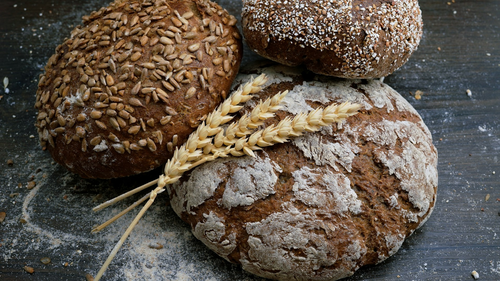
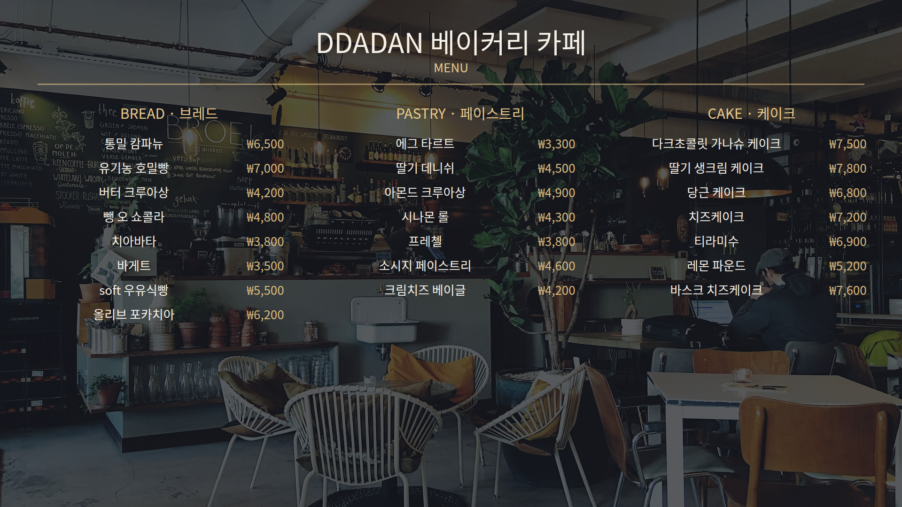
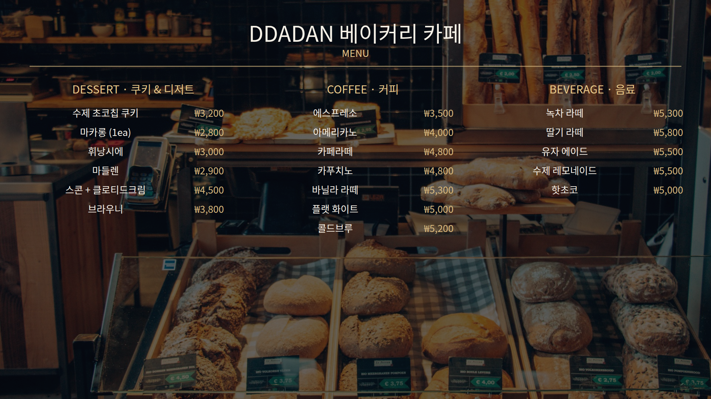
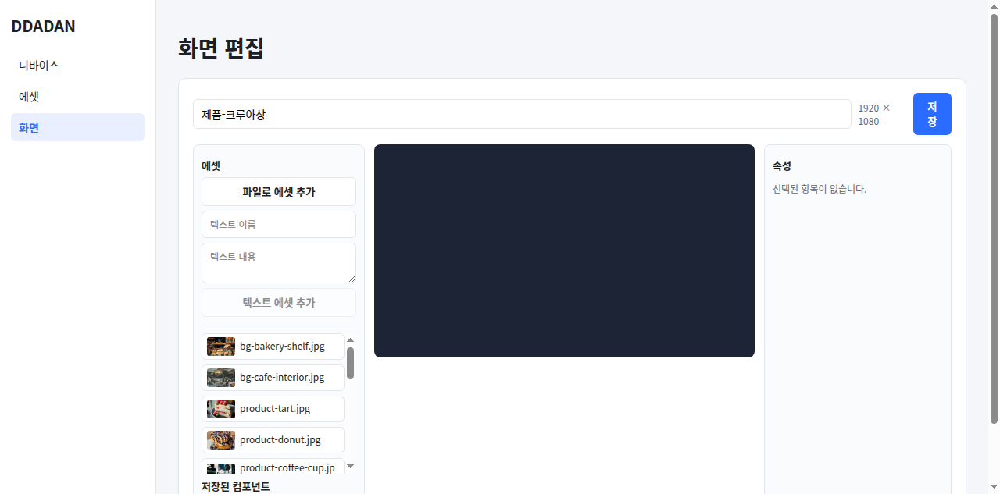
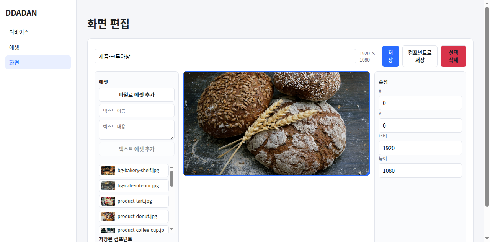
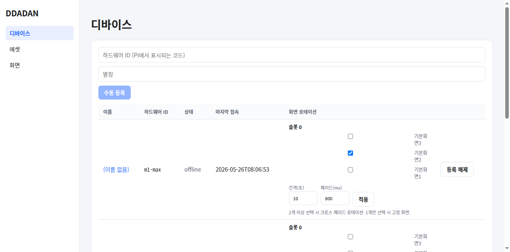

# DDADAN 사이니지 화면 구성 UX 개선 계획서

> 작성일: 2026-06-17
> 방법: 월드클래스 UI/UX 디자이너 관점에서 **실제 어드민(`display-1:4200`)을 `agent-browser`로 직접 조작**하여
> display-1(풀스크린 제품 로테이션) / display-2·3(딤 처리된 배경 위 메뉴판)을 구성하면서
> 사용자가 막히고 불편했던 지점을 1차 자료(스크린샷·실패 로그)로 기록했다.
> 베이커리 카페 메뉴 40개와 Unsplash 실사진 10장을 사용했다.

---

## 1. 무엇을 만들었나 (결과)

세 디스플레이 모두 라이브로 적용 완료. 모든 디바이스는 Tailscale 망에서 online.

| 디스플레이 | 구성 | 화면 ID | 모니터 |
|---|---|---|---|
| **display-1** | 베이커리 제품 6종 풀스크린 **크로스페이드 로테이션** (8초 간격) | 4·5·6·7·8·9 | monitor 2 (rotation) |
| **display-2** | 카페 내부 배경 + 딤 + 메뉴판 A (BREAD·PASTRY·CAKE, 22품목) | 10 | monitor 3 |
| **display-3** | 베이커리 진열장 배경 + 딤 + 메뉴판 B (DESSERT·COFFEE·BEVERAGE, 18품목) | 11 | monitor 4 |

총 메뉴 40품목 / 이미지 에셋 10장(제품 8 + 배경 2).

### display-1 — 풀스크린 제품 로테이션

### display-2 — 메뉴판 A (딤 배경)

### display-3 — 메뉴판 B (딤 배경)

> 결과물 자체는 “꽤 괜찮은 메뉴판”으로 보이지만, **이 결과를 어드민 UI만으로 만드는 것은 사실상 불가능했다.**
> 메뉴판 2개(96개 레이아웃 노드)와 로테이션 슬라이드 5개는 어드민으로 만들 수 없어 **API로 생성**해야 했다.
> 아래는 그 과정에서 막힌 지점이다.

---

## 2. 발견된 문제 (심각도 순)

심각도: 🔴 치명(작업 불가) · 🟠 높음(매우 번거로움) · 🟡 중간(개선 여지)

### A. 에디터 — 레이아웃 구성

| # | 심각도 | 문제 | 증거 / 재현 |
|---|---|---|---|
| A1 | 🔴 | **배경 이미지를 설정할 수 없다.** 데이터 모델에는 `ScreenLayout.background`가 있고 플레이어도 렌더링하지만, 에디터에 배경 입력 UI가 전혀 없다. → 메뉴판 배경을 “풀스크린 이미지 아이템”으로 위장해야 함. | `screen-edit.page.ts` 템플릿에 background 입력 없음 |
| A2 | 🔴 | **딤/오버레이/투명도 primitive가 없다.** 아이템 `background`·`opacity`를 바꾸는 입력이 인스펙터에 없다(텍스트는 글자색만, 이미지는 X/Y/W/H만). → 배경을 어둡게 까는 “딤”을 UI로 만들 방법이 없어, `background: rgba(8,10,16,.62)`를 가진 텍스트 아이템을 **API로 주입**함. | 인스펙터에 노출되는 필드: 텍스트=text/fontSize/color, 이미지=x/y/w/h 뿐 |
| A3 | 🔴 | **가격 우측정렬이 불가능.** 텍스트는 정렬·폰트·굵기·자간·줄간격이 없고 색/크기만 있다. 한 줄에 “이름 …… 가격”을 만들 수 없어 **모든 메뉴 줄을 텍스트 2개(이름+가격)로 쪼개 좌표로 배치**. 40줄 = 80+ 노드. | 메뉴판 A가 52노드, B가 44노드가 된 이유 |
| A4 | 🟠 | **새 아이템이 항상 X100 Y100 / 400×300에 겹쳐 쌓인다.** 여러 개 넣으면 한 더미로 포개져 매번 끌어내야 함. |  |
| A5 | 🟠 | **“화면 맞춤/풀스크린” 액션이 없다.** 풀스크린 이미지 1장 = 0/0/1920/1080 네 칸 수동 입력. 로테이션 슬라이드 6장이면 24회 반복. |  |
| A6 | 🟠 | **z-index/레이어 컨트롤이 없다.** 모델엔 `zIndex`가 있지만 인스펙터에 없음. 배경↔딤↔텍스트 순서를 “추가 순서”로만 통제 → 맨 뒤로/맨 앞으로 불가. | — |
| A7 | 🟠 | **다중 선택·정렬·분배·스냅·복제·복사붙여넣기가 전무.** 3열 22행 메뉴를 손으로 정렬하는 것은 비현실적. → 레이아웃 전체를 스크립트로 생성. | — |
| A8 | 🟠 | **화면 복제/템플릿이 없다.** 거의 동일한 풀스크린 슬라이드 6장을 한 장씩 새로 만들어야 함. | 슬라이드 5장 API 생성 |
| A9 | 🟡 | **스테이지가 작고 줌/팬·실사이즈 미리보기가 없다.** 작은 스케일에선 가독성·딤 정도를 판단 불가 → 실제 플레이어를 띄워서야 확인 가능. | 에디터 미리보기 vs 플레이어 렌더 차이 |

### B. 에셋 관리

| # | 심각도 | 문제 |
|---|---|---|
| B1 | 🟠 | **한 번에 1개 파일만 업로드.** `<input type=file>`에 `multiple`이 없고 핸들러도 `files?.[0]`만 사용. 이미지 10장 = 10회 반복. (UI로 1장 올린 뒤 나머지 9장은 스크립트로 처리함) |
| B2 | 🟡 | 드래그앤드롭 업로드·폴더·태그·검색 없음. 에셋이 많아지면 에디터의 `max-height:180px` 스크롤 목록이 사실상 사용 불가. |
| B3 | 🟡 | 업로드 시 크롭/리사이즈/비율 정규화 없음. |

### C. 접근성

| # | 심각도 | 문제 |
|---|---|---|
| C1 | 🟠 | **에셋/컴포넌트 라이브러리 타일이 `role` 없는 순수 `
`.** 키보드 포커스 불가, 스크린리더가 버튼으로 인식 못함. 실제로 `agent-browser`의 표준 클릭과 접근성 트리 클릭 모두 **활성화 실패**, raw DOM `.click()`로만 동작했다. 키보드 사용자는 화면을 구성할 수 없다. |

### D. 저장 / 데이터 안전

| # | 심각도 | 문제 |
|---|---|---|
| D1 | 🟠 | 수동 단일 “저장” 버튼만 존재. **자동저장·미저장 변경 경고 없음** → 다른 메뉴로 이동하면 편집 내용이 조용히 사라짐. |
| D2 | 🟡 | 실행취소/다시실행(undo/redo) 없음. |

### E. 디바이스 / 로테이션 할당

| # | 심각도 | 문제 |
|---|---|---|
| E1 | 🟠 | **화면 할당 경로가 둘로 갈라져 충돌.** 디바이스 **목록** 페이지엔 체크박스 로테이션(+간격/페이드)이, 디바이스 **상세** 페이지엔 단일 `<select>`+모니터 드래그가 있다. 상세 페이지는 로테이션 자체가 불가. 어디서 무엇을 해야 하는지 혼란. |
| E2 | 🟠 | **로테이션 슬라이드 순서를 바꿀 수 없다.** 순서가 “선택 순서”가 아니라 **전역 화면 생성 순서**로 고정(`screens().map(s=>s.id)`로 정렬). 슬라이드 순서를 바꾸려면 화면을 재생성/개명해야 함. |
| E3 | 🟡 | 로테이션 선택지가 **이름만** 표시(썸네일 없음). “기본화면2”가 무슨 화면인지 모른 채 할당. |
| E4 | 🟡 | 할당 UI가 넓은 표 셀 안에 들어가 라벨이 “기본화 / 면2”로 줄바꿈되는 등 좁고 읽기 어려움. |

### F. 그 외

| # | 심각도 | 문제 |
|---|---|---|
| F1 | 🟡 | 어드민에서 **“이 디바이스로 미리보기”** 버튼이 없어 `player/?deviceId=...` URL을 수동 조합해야 함. |
| F2 | 🟡 | 콘텐츠 **스케줄링/시간대(dayparting)** 없음, **슬라이드별 노출시간**(`durationMs` 모델에 존재하나 미사용) 없음 — 전역 로테이션 간격 하나뿐. |

---

## 3. 디자인 관점 추가 제언 (결과물 품질)

만든 메뉴판은 양호하지만 월드클래스 기준에선:

- **균일 딤 → 그라데이션 딤**: 하단(밝은 의자·창)에서 텍스트 대비가 떨어진다. 텍스트가 놓이는 영역만 더 어둡게(선형 그라데이션) 처리하면 가독성↑. (현재는 단일 `rgba` 한 장)
- **타이포 스케일 정립**: 타이틀/카테고리/품목/가격의 위계가 크기 차이에만 의존. 굵기·자간·대문자 트래킹이 없어 “디자인된” 느낌이 약함 → A3 폰트 컨트롤과 직결.
- **가격 정렬·도트 리더**: 메뉴판의 기본 문법인 “이름 ………… 가격” 점선 리더가 불가(A3).
- **세이프 영역/그리드**: 8pt 그리드·세이프마진 가이드가 없어 손으로 맞추면 들쭉날쭉(A7).
- **이미지 포커스/object-position**: 풀스크린 이미지가 `object-fit:cover` 고정 — 제품이 잘리는 위치를 조절할 수 없다.

---

## 4. 개선 로드맵 (우선순위)

### P0 — “UI만으로 이번 작업이 가능” 하게 만드는 최소 변경
1. **인스펙터 확장(A1·A2·A6)**: 화면 배경(색/이미지) 설정, 아이템 `background`·`opacity`·`zIndex`(맨앞/맨뒤) 입력 추가. → 딤·레이어가 코드 없이 가능해짐.
2. **풀스크린/배경으로 맞춤 버튼(A5)** + **새 아이템 비겹침 배치(A4)**.
3. **텍스트 타이포 컨트롤(A3)**: font-weight, text-align, line-height, (가능하면) 한 줄에 가격 우측정렬을 위한 “라벨+값” 텍스트 타입 또는 도트리더 옵션.
4. **미저장 변경 경고(D1)**: 라우트 가드 + 자동저장(디바운스).

### P1 — 반복 작업 제거
5. **다중 선택·정렬/분배·복제·스냅 그리드(A7)**.
6. **화면 복제 & 템플릿(A8)**, **다중 파일 업로드 + 드래그앤드롭(B1)**.
7. **로테이션 슬라이드 순서 드래그 정렬(E2)** + **썸네일 표시(E3)**.
8. **할당 UX 일원화(E1)**: 디바이스 상세를 단일 출처로 통합(로테이션 포함), 목록은 요약만.

### P2 — 완성도/운영
9. 접근성: 라이브러리 타일을 `<button>`/`role`+키보드 지원으로(C1).
10. 줌/실사이즈 미리보기·“디바이스로 미리보기”(A9·F1), undo/redo(D2).
11. 스케줄링·슬라이드별 duration·dayparting(F2), 업로드 크롭(B3), 그라데이션 딤 프리셋(§3).

---

## 5. 코드 포인트 (구현 시작점)

- 에디터 인스펙터/스테이지: `apps/ddadan-admin-app/src/app/pages/screen-edit.page.ts`
  - 인스펙터 필드 추가 위치: 템플릿 `.inspector` 블록(약 110–132행), 기본 배치값 `addFromAsset()`(약 332행).
- 화면 배경/아이템 모델: `apps/ddadan-api-server/src/screens/screen.entity.ts` (`ScreenLayout.background`, `ScreenLayoutItem.zIndex/background/durationMs` 이미 존재 — 대부분 **백엔드는 준비돼 있고 프론트 노출만 없음**).
- 에셋 업로드: `assets.page.ts`(전용), `screen-edit.page.ts`(인라인) — `<input type=file>`에 `multiple` 추가 + 핸들러 루프.
- 로테이션 할당/순서: `apps/ddadan-admin-app/src/app/pages/devices.page.ts` (`togglePick`의 `order` 정렬 로직 E2), 단일 select은 `device-detail.page.ts`.
- 라이브러리 타일 접근성: `screen-edit.page.ts`의 `.library-item` `
` → 버튼화.

> 핵심: **데이터 모델·플레이어·API는 대부분 이미 기능을 갖추고 있고, 어드민 프론트엔드의 “노출/조작 UI”만 빠져 있다.** P0의 인스펙터 확장만으로도 이번 같은 작업을 UI 단독으로 수행 가능해진다.

---

## 부록 — 재현 자산
- 메뉴 데이터: `.ux-build/menu.json` (40품목)
- 화면 생성 스크립트: `.ux-build/build_screens.py`
- 다운로드 이미지: `.ux-build/images/` (Unsplash, 제품 8 + 배경 2)
- 캡처: `docs/ux/assets/`
